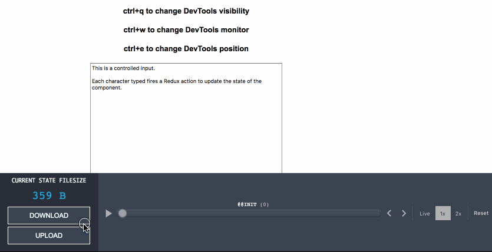

[](https://www.npmjs.com/package/redux-devtools-upload-download-monitor)

# Redux DevTools Upload/Download Monitor



A monitor for [Redux DevTools](https://github.com/gaearon/redux-devtools) to enable uploading and downloading of serialized application states. Pairs well with [Redux Slider Slider Monitor](https://github.com/calesce/redux-slider-monitor)! (Shown bottom-right.) See "Usage" below.

This is a re-implementation of [Redux Import Export Monitor](https://github.com/lapanoid/redux-import-export-monitor), with the goal being to work well with very large application states.

# Why?
Modernize your quality assurance workflows! Instead of sharing long, verbose descriptions or even recorded-movies demonstrating how to reproduce a bug, just share the application state!

Like most Redux DevTools monitors, this tool works best if *as much as possible* of your application state is reflected by your Redux store's state.

# Installation
```bash
yarn add --dev redux-devtools-upload-download-monitor
# Or, if using NPM:
npm install --save-dev redux-devtools-upload-download-monitor
```

# Usage
```js
import React from 'react';
import { createDevTools } from 'redux-devtools';
import UploadDownloadMonitor from 'redux-devtools-upload-download-monitor';

export default createDevTools(
  <UploadDownloadMonitor />
);
```
You can also pass [SliderMonitor](https://github.com/calesce/redux-slider-monitor) as a child to display both side-by-side! If you're using to assist in reproducing bugs on a team project, I recommend a configuration like this:
```js
<DockMonitor
  fluid={false}
  defaultSize={170}
  defaultPosition="bottom">
  <UploadDownloadMonitor>
    <SliderMonitor />
  </UploadDownloadMonitor>
</DockMonitor>
```

# Development
```bash
yarn start # Open http://localhost:8080 for a demo page utilizing the monitor from ./src
```
